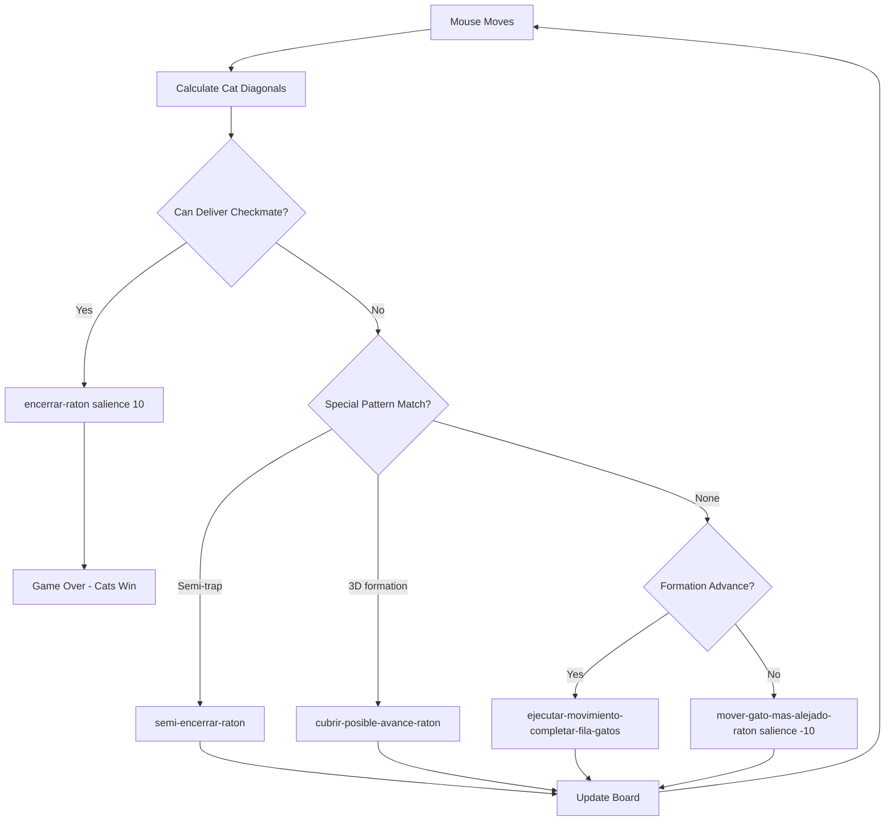

## The Perfect Strategy

<Warning>
**100% Win Rate Guarantee**

From the project README (line 6):

> "El sistema presenta la inteligencia artificial de las piezas de los gatos, de manera que un 100% de las partidas son ganadas por los gatos."

*The system presents the artificial intelligence of the cat pieces, such that 100% of the games are won by the cats.*
</Warning>

The cat AI achieves perfect play through a hierarchy of strategic rules that cover every possible game state. The strategy is deterministic and complete - there are no positions where the mouse can escape if the cats follow these rules.

## Rule Priorities and Firing Order

CLIPS executes rules based on **salience** values. Higher salience rules fire first when multiple rules match.

### Strategic Priority Hierarchy

| Priority | Salience | Rule | Purpose |
|----------|----------|------|----------|
| **Highest** | `10` | `encerrar-raton` | Deliver checkmate when mouse has only 1 escape |
| Standard | `0` (default) | `ejecutar-movimiento-completar-fila-gatos` | Advance cats in formation |
| Standard | `0` | `semi-encerrar-raton-que-esta-en-medio` | Semi-trap mouse in middle positions |
| Standard | `0` | `cubrir-posible-avance-raton` | Cover special advance patterns |
| **Lowest** | `-10` | `mover-gato-mas-alejado-raton` | Default: close distance to mouse |

<Info>
The rule firing order ensures the AI always attempts the winning move first, falls back to positional advancement, and only uses generic movement when no tactical pattern matches.
</Info>

## Key Strategic Rules

### 1. Buscar Diagonales Gatos

**File**: raton_y_gatos.clp:542-610

**Purpose**: Calculate diagonal attack squares for each cat (forward-left and forward-right).

```clips
(defrule buscar-diagonales-gatos
  "Regla para añadir un hecho que contiene las esquinas de cada gato.
   El hecho contendrá la fila superior y las dos columnas adyacentes,
   es decir la esquina izquierda y la esquina derecha de cada gato."
  
  (buscar-diagonales-gatos)
  
  ?idGato <-(casilla (fila ?filaGatos) (columna ?columnaGatos) (valor 5 ?))
  
  =>
  
  (bind ?fila-a-buscar(- ?filaGatos 1))
  (bind ?columna-der-a-buscar(+ ?columnaGatos 1))
  (bind ?columna-izq-a-buscar(- ?columnaGatos 1))
  
  (if (> ?fila-a-buscar 1)
    then
      ; Handle edge cases for columns 1 and 8
      (if (= ?columna-izq-a-buscar 0)
        then
        (assert(esquina-gato ?idGato ?fila-a-buscar 1 ?columna-der-a-buscar))
      )
      
      (if (= ?columna-der-a-buscar 9)
        then
        (assert(esquina-gato ?idGato ?fila-a-buscar ?columna-izq-a-buscar 8))
      )
      
      (if (and(> ?columna-izq-a-buscar 0)(< ?columna-der-a-buscar 9))
        then
        (assert(esquina-gato ?idGato ?fila-a-buscar ?columna-izq-a-buscar ?columna-der-a-buscar))
      )
    else
    (assert(esquina-gato ?idGato ?filaGatos ?columna-izq-a-buscar ?columna-der-a-buscar))
  )
)
```

**Strategy**: This foundational rule runs after every mouse move to determine which diagonal squares each cat can attack. Cats can only move forward diagonally, so this pre-computation enables all tactical rules.

<Accordion title="Why Diagonal Calculation Matters">
Cats move like checkers pieces - only forward diagonally on black squares. By asserting `(esquina-gato ...)` facts, other strategic rules can pattern-match against available moves without recalculating positions.

This is a classic expert system technique: **derive intermediate facts** that make higher-level rules simpler and more readable.
</Accordion>

---

### 2. Ejecutar Movimiento Completar Fila Gatos

**File**: raton_y_gatos.clp:612-700

**Purpose**: Advance cats in a unified front, maintaining formation while pushing toward the mouse.

**Strategy Visualization**:

```
Initial Position:
 _______________
8 |_|#|_|4|_|#|_|#|     Mouse at row 1
7 |#|_|#|_|#|_|#|_|
6 |_|#|_|#|_|#|_|#|
5 |#|_|#|_|#|_|#|_|
4 |_|#|_|#|_|#|_|#|
3 |#|_|#|_|#|_|#|_|
2 |_|1|_|1|_|1|_|1|     Available squares
1 |5|_|5|_|5|_|5|_|     Cats at row 8
  1 2 3 4 5 6 7 8

First Move (Cat at column 1):
 _______________
8 |_|#|_|4|_|#|_|#|
7 |#|_|#|_|#|_|#|_|
6 |_|#|_|#|_|#|_|#|
5 |#|_|#|_|#|_|#|_|
4 |_|#|_|#|_|#|_|#|
3 |1|_|1|_|#|_|#|_|     Cat #1 advanced
2 |_|5|_|1|_|1|_|1|
1 |#|_|5|_|5|_|5|_|
  1 2 3 4 5 6 7 8
```

**Key Logic**: Move the cat that has only **one available diagonal** (one esquina with value 1). This creates a "wave" effect where cats advance in sequence.

<Tip>
This rule implements the fundamental cat strategy: advance as a wall to reduce the mouse's escape space. By moving the most constrained cat first, formation integrity is maintained.
</Tip>

---

### 3. Mover Gato Mas Alejado Raton

**File**: raton_y_gatos.clp:941-1108

**Salience**: `-10` (lowest priority - fallback rule)

**Purpose**: When no tactical pattern matches, move the cat farthest from the mouse to close the net.

```clips
(defrule mover-gato-mas-alejado-raton
  "Regla que contien la lógica para determinar cuando se debe mover
   el gato más alejado del raton."
  
  (declare (salience -10))
  
  ?hechoMoverGatoMasAlejado <- (gato-mas-alejado)
  
  (casilla (fila ?)(columna ?colRaton)(valor 4))
  
  ?gato1 <- (casilla (fila ?filaGato1)(columna ?colGato1)(valor 5 1))
  ?gato2 <- (casilla (fila ?filaGato2)(columna ?colGato2)(valor 5 2))
  ?gato3 <- (casilla (fila ?filaGato3)(columna ?colGato3)(valor 5 3))
  ?gato4 <- (casilla (fila ?filaGato4)(columna ?colGato4)(valor 5 4))
  
  =>
  (retract ?hechoMoverGatoMasAlejado)
  
  (bind ?diferencia1 (abs (- ?colRaton ?colGato1)))
  (bind ?diferencia2 (abs (- ?colRaton ?colGato2)))
  (bind ?diferencia3 (abs (- ?colRaton ?colGato3)))
  (bind ?diferencia4 (abs (- ?colRaton ?colGato4)))
  
  (if(or (> ?diferencia1 2)(> ?diferencia2 2)
         (> ?diferencia3 2)(> ?diferencia4 2))
    then
      ; Move the cat with maximum column distance
      (if(and (> ?diferencia1 ?diferencia2)
              (> ?diferencia1 ?diferencia3)
              (> ?diferencia1 ?diferencia4))
        then
        (bind ?filaNueva (- ?filaGato1 1))
        (if ( > ?colRaton 4)
          then
          (bind ?colNueva (+ ?colGato1 1))  ; Move right toward mouse
          else
          (bind ?colNueva (- ?colGato1 1))  ; Move left toward mouse
        )
        (assert(fila-columna-mover-gatos ?filaNueva ?colNueva ?gato1))
        (assert(ejecutar-movimiento-maquina-gato))
      )
      ; Similar logic for gato2, gato3, gato4...
  )
)
```

**Strategy**: Calculate horizontal distance for each cat. Move the farthest one toward the mouse's column while advancing forward. This prevents the mouse from slipping past the sides.

---

### 4. Semi-Encerrar Raton Que Esta En Medio

**File**: raton_y_gatos.clp:1110-1223

**Purpose**: Detect when the mouse is trapped between two cats and tighten the formation.

**Pattern Detection**:

```
Before:
 _______________
8 |_|#|_|#|_|#|_|#|
7 |#|_|#|_|#|_|#|_|
6 |_|#|_|#|_|#|_|#|
5 |#|_|#|_|#|_|#|_|
4 |_|#|_|#|_|#|_|#|
3 |#|_|5|_|4|_|5|_|     Mouse between two cats
2 |_|#|_|5|_|5|_|#|
1 |#|_|#|_|#|_|#|_|
  1 2 3 4 5 6 7 8

After:
 _______________
8 |_|#|_|#|_|#|_|#|
7 |#|_|#|_|#|_|#|_|
6 |_|#|_|#|_|#|_|#|
5 |#|_|#|_|#|_|#|_|
4 |_|#|_|5|_|#|_|#|     Cat closes in diagonally
3 |#|_|#|_|4|_|5|_|
2 |_|#|_|5|_|5|_|#|
1 |#|_|#|_|#|_|#|_|
  1 2 3 4 5 6 7 8
```

**Pattern Matching Logic**:

```clips
; Mouse must be on same row as 2 cats, with other 2 cats one row forward
(test (or (and (= ?filaRaton ?filaGato1 ?filaGato4)
               (= (+ ?filaRaton 1) ?filaGato2 ?filaGato3))
          (and (= ?filaRaton ?filaGato2 ?filaGato4)
               (= (+ ?filaRaton 1) ?filaGato1 ?filaGato3))))

; Cats must be positioned 1 and 2 columns away on each side
(test (or (and (= (+ ?colRaton 1) ?colGato3)
               (= (+ ?colRaton 2) ?colGato4)
               (= (- ?colRaton 1) ?colGato2)
               (= (- ?colRaton 2) ?colGato1))
          ...))
```

<Note>
This rule demonstrates the power of declarative pattern matching. The complex spatial relationship is expressed clearly in the rule conditions, not buried in procedural loops.
</Note>

---

### 5. Encerrar Raton

**File**: raton_y_gatos.clp:1302-1678

**Salience**: `10` (highest priority - finishing move)

**Purpose**: Deliver checkmate by moving into the mouse's last remaining escape square.

```clips
(defrule encerrar-raton
  "Comprueba si el raton solo tiene una casilla disponible para moverse,
   en caso de cumplirse esto, busca un gato que pueda llegar a esta posicion."
  
  (declare (salience 10))
  
  (encerrar-raton)
  
  ?h <- (esquinasRaton ?fila-inferior ?fila-superior ?columnaIzq ?columnaDer)
  
  (casilla (fila ?fila-inferior)(columna ?columnaIzq)(valor ?valorInferiorIzq $?))
  (casilla (fila ?fila-inferior)(columna ?columnaDer)(valor ?valorInferiorDer $?))
  (casilla (fila ?fila-superior)(columna ?columnaIzq)(valor ?valorSuperiorIzq $?))
  (casilla (fila ?fila-superior)(columna ?columnaDer)(valor ?valorSuperiorDer $?))
  
  ?gato1 <- (casilla (fila ?filaGato1)(columna ?colGato1)(valor 5 1))
  ?gato2 <- (casilla (fila ?filaGato2)(columna ?colGato2)(valor 5 2))
  ?gato3 <- (casilla (fila ?filaGato3)(columna ?colGato3)(valor 5 3))
  ?gato4 <- (casilla (fila ?filaGato4)(columna ?colGato4)(valor 5 4))
  
  =>
  (retract ?h)
  
  ; Check if only inferior-left square is available (value 1)
  (if (and (= ?valorInferiorIzq 1)
           (<> ?valorInferiorDer 1)
           (<> ?valorSuperiorIzq 1)
           (<> ?valorSuperiorDer 1))
    then
      ; Find which cat can reach that square
      (bind ?filaGato1 (- ?filaGato1 1))
      (bind ?esquinaDerGato1 (+ ?colGato1 1))
      
      (if (and (= ?fila-inferior ?filaGato1)
               (= ?columnaIzq ?esquinaDerGato1))
        then
        (assert(fila-columna-mover-gatos ?fila-inferior ?esquinaDerGato1 ?gato1))
        (assert(ejecutar-movimiento-maquina-gato))
        (assert(finalizar-juego))  ; Game over!
      )
      ; Check gato2, gato3, gato4 similarly...
  )
  
  ; Repeat for other 3 directions (inferior-right, superior-left, superior-right)
)
```

**Strategy Explanation**:

1. Check all 4 diagonal squares around the mouse
2. If exactly **one** square has value `1` (empty), the mouse is nearly trapped
3. Find which cat has that square in its diagonal attack range
4. Move that cat to deliver checkmate
5. Assert `(finalizar-juego)` to end the game

<Warning>
**Why This Rule Has Salience 10**

This is the **only** rule with positive salience. When the mouse has one escape square remaining, this rule **must** fire immediately to prevent other rules from making suboptimal moves.

Without this priority, the cats might advance their formation instead of delivering the killing blow, potentially allowing the mouse an extra move.
</Warning>

---

### 6. Cubrir Posible Avance Raton

**File**: raton_y_gatos.clp:1680-2035

**Purpose**: Handle special geometric patterns where the mouse could break through.

This rule contains **3D pattern recognition** for complex formations:

#### Pattern 1: 3D Diagonal Right

```
Dangerous Position:
 _______________
8 |_|#|_|#|_|#|_|#|
7 |#|_|#|_|#|_|#|_|
6 |_|#|_|4|_|#|_|#|     Mouse forward
5 |#|_|#|_|#|_|#|_|
4 |_|#|_|5|_|5|_|#|     Cat line with gap
3 |#|_|#|_|5|_|#|_|     One cat back-right
2 |_|5|_|#|_|#|_|#|
1 |#|_|#|_|#|_|#|_|
  1 2 3 4 5 6 7 8
```

**Solution**: Move the cat directly below the mouse to block the diagonal breakthrough.

```clips
(if (and (= (+ ?filaRaton 2) ?filaGato1)(= ?colGato1 ?colRaton) )
  then
  (if (or (= (+ ?colGato1 2) ?colGato2)
          (= (+ ?colGato1 2) ?colGato3)
          (= (+ ?colGato1 2) ?colGato4))
    then
    (if (or  (and (= (+ ?filaGato1 1) ?filaGato2)
                  (= (+ ?colGato1 1) ?colGato2))
             ...)
      then
      (bind ?fila-esquina(- ?filaGato1 1))
      (bind ?col-esquina-derecha(- ?colGato1 1))
      (assert(fila-columna-mover-gatos ?fila-esquina ?col-esquina-derecha ?gato1))
      (assert(ejecutar-movimiento-maquina-gato))
    )
  )
)
```

<Accordion title="Other Patterns in This Rule">
- **Pattern 2**: Three cats in a row with one cat behind ("Serpiente" / Snake)
- **Pattern 3**: 3D diagonal left (mirror of Pattern 1)
- **Pattern 4**: Three in a row with diagonal cat to right

Each pattern has 30-50 lines of conditional logic to detect the exact formation and respond correctly.
</Accordion>

## Complete Strategy Summary



## Why 100% Win Rate?

The strategy achieves perfect play because:

### Complete Coverage
Every possible board state is covered by at least one rule:
- Endgame: `encerrar-raton`
- Mid-game tactics: `semi-encerrar-raton`, `cubrir-posible-avance-raton`
- Formation: `ejecutar-movimiento-completar-fila-gatos`
- Fallback: `mover-gato-mas-alejado-raton`

### Optimal Priorities
Salience ensures tactical moves override positional moves:
- Checkmate (salience 10) always fires when available
- Formation and tactics (salience 0) execute in middle game
- Closing distance (salience -10) only when nothing else applies

### Mathematical Certainty
The mouse starts at row 1, cats at row 8. The mouse must travel 7 rows while 4 cats converge. The geometry guarantees interception with optimal play.

<Info>
**Game Theory Classification**

This is a **solved game** with perfect information. Like Tic-Tac-Toe, optimal play from both sides produces a deterministic outcome. The cats' strategy is a **perfect winning strategy** from the starting position.
</Info>

## See Also

- [Expert System Architecture](/ai-system/expert-system) - How CLIPS rules work
- [Game Logic](/ai-system/game-logic) - Board representation and mechanics