## Board Representation

The game uses CLIPS templates to represent an 8x8 checkerboard with pieces.

### Casilla Template

**File**: raton_y_gatos.clp:76-87

The fundamental data structure representing each square on the board:

```clips
(deftemplate casilla
  "Define la estructura de las casillas de un tablero de ajedrez"
  
  ; Row number (1-8)
  (slot fila (type NUMBER))
  
  ; Column number (1-8)
  (slot columna (type NUMBER))
  
  ; Cell contents: 0=white, 1=black empty, 4=mouse, 5=cat
  (multislot valor (type NUMBER))
)
```

**Value Encoding**:

| Valor | Meaning | ASCII Representation |
|-------|---------|---------------------|
| `0` | White square (unplayable) | `"       "` (spaces) |
| `1` | Black square (empty) | `" . . . "` (dots) |
| `4` | Mouse piece | `"(_)_(_)" / " (o o) " / "==\\o/=="` |
| `5 N` | Cat piece ID N (1-4) | `" /\\_/\ " / "( o.o )" / " > ^ < "` |

<Note>
Cats use a **multislot** for valor: `(valor 5 1)` means cat type with ID 1. This allows the system to track which specific cat is at each position.
</Note>

### Pieza Template

**File**: raton_y_gatos.clp:89-104

Defines the ASCII art representation for rendering:

```clips
(deftemplate pieza
  "Estructura de las piezas a imprimir por pantalla.
   Cada casilla internamente consta de un espacio de 3x3"
  
  (slot valor)    ; Links to casilla valor
  (slot parte1)   ; Top row of 3x3 display
  (slot parte2)   ; Middle row
  (slot parte3)   ; Bottom row
)
```

**Example Facts**:

```clips
; White square
(pieza (valor 0)
       (parte1 "       ")
       (parte2 "       ")
       (parte3 "       "))

; Black empty square  
(pieza (valor 1)
       (parte1 " . . . ")
       (parte2 " . . . ")
       (parte3 " . . . "))

; Mouse
(pieza (valor 4)
       (parte1 "(_)_(_)")
       (parte2 " (o o) ")
       (parte3 "==\\o/=="))

; Cat
(pieza (valor 5)
       (parte1 " /\\_/\ ")
       (parte2 "( o.o )")
       (parte3 " > ^ < "))
```

### Board Initialization

**File**: raton_y_gatos.clp:164-207

The board is created using a nested loop pattern:

```clips
(defrule ingresar-tablero-en-blanco
  "Regla que determina el valor de una casilla basandose en un tablero
   de ajedrez 8x8."
  
  ?h <- (ingresar-tablero)
  =>
  
  (retract ?h)
  (assert (ingresar-pos-iniciales))
  
  ; Create 64 squares
  (loop-for-count (?i 1 8)do
    (loop-for-count (?j 1 8)do
      
      ; Checkerboard pattern: (row + col) % 2 == 0 → white, else → black
      (if (eq(mod (+ ?i ?j) 2) 0)
        then
          (assert (casilla (fila ?i)(columna ?j)(valor 0)))
        else
          (assert (casilla (fila ?i)(columna ?j)(valor 1)))
      )
    )
  )
)
```

**Checkerboard Logic**: 
- If `(row + column) % 2 == 0` → white square (valor 0)
- Otherwise → black square (valor 1)

<Accordion title="Why This Works">
Consider row 1:
- Column 1: (1+1)%2 = 0 → white
- Column 2: (1+2)%2 = 1 → black  
- Column 3: (1+3)%2 = 0 → white
- ...

Row 2:
- Column 1: (2+1)%2 = 1 → black
- Column 2: (2+2)%2 = 0 → white
- ...

This creates the alternating checkerboard pattern automatically.
</Accordion>

### Initial Piece Positions

**File**: raton_y_gatos.clp:209-259

```clips
(defrule posiciones-piezas-iniciales
  "Regla para modificar el tablero en blanco y añadirle la posicion
   de las piezas iniciales."
  
  ?h <- (ingresar-pos-iniciales)
  
  ; Mouse at row 1, column 4
  ?raton <- (casilla (fila 1)(columna 4)(valor ?))
  
  ; Four cats at row 8, odd columns
  ?gato1 <- (casilla (fila 8)(columna 1)(valor ?))
  ?gato2 <- (casilla (fila 8)(columna 3)(valor ?))
  ?gato3 <- (casilla (fila 8)(columna 5)(valor ?))
  ?gato4 <- (casilla (fila 8)(columna 7)(valor ?))
  
  =>
  
  (modify ?raton (valor 4))
  
  ; Cats store [type, id] in multislot
  (modify ?gato1 (valor 5 1))
  (modify ?gato2 (valor 5 2))
  (modify ?gato3 (valor 5 3))
  (modify ?gato4 (valor 5 4))
  
  (retract ?h)
)
```

**Starting Position**:

```
 ------- ------- ------- ------- ------- ------- ------- -------
| /\_/\ |       | /\_/\ |       | /\_/\ |       | /\_/\ |       | 8
|( o.o )|       |( o.o )|       |( o.o )|       |( o.o )|       |
| > ^ < |       | > ^ < |       | > ^ < |       | > ^ < |       |
 ------- ------- ------- ------- ------- ------- ------- -------
|       | . . . |       | . . . |       | . . . |       | . . . | 7
|       | . . . |       | . . . |       | . . . |       | . . . |
|       | . . . |       | . . . |       | . . . |       | . . . |
 ------- ------- ------- ------- ------- ------- ------- -------
  ...
 ------- ------- ------- ------- ------- ------- ------- -------
|       |(_)_(_)|       | . . . |       | . . . |       | . . . | 1
|       | (o o) |       | . . . |       | . . . |       | . . . |
|       |==\o/==|       | . . . |       | . . . |       | . . . |
 ------- ------- ------- ------- ------- ------- ------- -------
   1       2       3       4       5       6       7       8
```

## Movement Validation

Both the mouse and cats move diagonally on black squares only, but with different constraints.

### Mouse Movement Rules

**File**: raton_y_gatos.clp:367-439

The mouse can move to any of its 4 diagonal neighbors (forward or backward):

```clips
(defrule pedir-movimiento-raton
  "Regla para solicitar la posicion hacia donde se movera el raton"
  
  ?h <- (pedir-movimiento-raton)
  (casilla(fila ?filaActual) (columna ?columnaActual)(valor 4))
  
  =>
  (retract ?h)
  (bind ?repetir TRUE)
  
  (while (eq ?repetir TRUE)do
    
    (printout t crlf "Ingresa la fila y la columna donde se moverá el ratón:" crlf)
    (printout t "Fila    [1-8] :")
    (bind ?fila (read))
    (printout t "Columna [1-8] :")
    (bind ?columna (read))
    
    ; Validate within board bounds
    (if (or (> ?fila 8) (> ?columna 8) (< ?fila 1) (< ?columna 1) )
      then
        (printout t crlf "Posición fuera del rango del tablero..."crlf
                        "INGRESE NUEVAMENTE."crlf crlf)
      else
        
        (bind ?diferenciaFilas (abs (- ?filaActual ?fila)))
        (bind ?diferenciaColumnas (abs (- ?columnaActual ?columna)))
        
        ; Valid diagonal: row_diff + col_diff = 2, and both changed
        (if (and(= (+ ?diferenciaFilas ?diferenciaColumnas) 2 )
                (<> ?filaActual ?fila)
                (<> ?columnaActual ?columna))
          then
            (assert (fila-columna-a-mover ?fila ?columna))
            (assert (comprobar-casilla-ocupada))
            (bind ?repetir FALSE)
            (clear-window)
          else
            (printout t crlf "Posición fuera de alcance del ratón..."crlf
                            "INGRESE NUEVAMENTE."crlf crlf)
        )
    )
  )
)
```

**Diagonal Validation Logic**:

```
Mouse at (4, 4)

  3  4  5
3 [ ]    [ ]     diferenciaFilas = |4-3| = 1
4    [M]         diferenciaColumnas = |4-3| = 1
5 [ ]    [ ]     Sum = 2 ✓ Valid diagonal

  3  4  5
2 [X]              Sum = |4-2| + |4-3| = 2+1 = 3 ✗ Invalid
```

<Tip>
The constraint `diferenciaFilas + diferenciaColumnas = 2` with both values non-zero ensures exactly one diagonal square away.
</Tip>

### Occupancy Check

**File**: raton_y_gatos.clp:441-485

```clips
(defrule comprobar-casilla-ocupada
  "Regla para verificar que la posicion a mover del raton no se
   encuentra ocupada por otra pieza."
  
  ?h <- (comprobar-casilla-ocupada)
  ?f<-(fila-columna-a-mover ?f1 ?c1)
  (casilla (fila ?f1)(columna ?c1)(valor ?value $?))
  
  =>
  (retract ?h)
  
  ; Valor 1 = empty black square
  (if (= ?value 1)
    then
      (assert (ejecutar-movimiento-jugador-raton))
    else
      ; Square occupied - reject move
      (assert (pedir-movimiento-raton))
      (assert (actualizar-tablero))
      (printout t crlf "la posición ya está ocupada..."crlf
                      "INGRESE NUEVAMENTE."crlf crlf)
      (retract ?f)
  )
)
```

### Cat Movement Constraints

Cats are constrained to **forward diagonal moves only** (toward row 1). This is enforced in the strategic rules:

```clips
; In buscar-diagonales-gatos (line 542)
(bind ?fila-a-buscar(- ?filaGatos 1))  ; Always row-1 (forward)
(bind ?columna-der-a-buscar(+ ?columnaGatos 1))  ; Right diagonal
(bind ?columna-izq-a-buscar(- ?columnaGatos 1))  ; Left diagonal
```

Cats **cannot**:
- Move backward (increasing row number)
- Move sideways or straight
- Jump over pieces
- Occupy the same square as another cat

## Turn Management

The game alternates between mouse and cat turns using control facts.

### Turn Cycle

```mermaid
graph LR
    A[Mouse Turn] -->|pedir-movimiento-raton| B[Get Player Input]
    B -->|comprobar-casilla-ocupada| C[Validate Move]
    C -->|ejecutar-movimiento-jugador-raton| D[Execute Mouse Move]
    D -->|calcular-esquinas-raton| E[Analyze Board]
    E -->|buscar-diagonales-gatos| F[Calculate Cat Diagonals]
    F -->|Strategic Rule Fires| G[Select Cat Move]
    G -->|ejecutar-movimiento-maquina-gato| H[Execute Cat Move]
    H -->|actualizar-tablero| I[Redraw Board]
    I -->|pedir-movimiento-raton| A
```



### Control Facts Pattern

**File**: raton_y_gatos.clp:110-126

Initial control facts bootstrap the execution:

```clips
(deffacts hechos-iniciales
  "Declaracion de hechos iniciales"
  
  (ingresar-tablero)      ; Trigger board creation
  (imprime 1 1)           ; Display cursor
  (parteImprimir 1)       ; Row of 3x3 cell to render
  (actualizar-tablero)    ; Redraw screen
  ; ... pieza template facts ...
)
```

Rules assert and retract control facts to orchestrate the game flow:

```clips
; After mouse moves
(assert (calcular-esquinas-raton))  ; Phase 1: Analysis

; After analysis  
(assert (buscar-diagonales-gatos))  ; Phase 2: Cat movement options
(assert (encerrar-raton))           ; Phase 3: Strategy selection
(assert (semi-encerrar-raton))
(assert (gato-mas-alejado))

; After cat selects move
(assert (ejecutar-movimiento-maquina-gato))  ; Phase 4: Execute

; After execution
(assert (actualizar-tablero))       ; Phase 5: Display
(assert (pedir-movimiento-raton))   ; Back to mouse turn
```

<Note>
**Why This Works**

Each phase retracts its control fact immediately upon execution:

```clips
?h <- (calcular-esquinas-raton)
=>
(retract ?h)
```

This ensures each phase runs exactly once per turn cycle, preventing infinite loops.
</Note>

## Game State Tracking

The game state is implicitly represented by facts in working memory:

### Current State Query Examples

```clips
; Find mouse position
(casilla (fila ?mouseRow) (columna ?mouseCol) (valor 4))

; Find all cat positions
(casilla (fila ?catRow1) (columna ?catCol1) (valor 5 1))
(casilla (fila ?catRow2) (columna ?catCol2) (valor 5 2))
(casilla (fila ?catRow3) (columna ?catCol3) (valor 5 3))
(casilla (fila ?catRow4) (columna ?catCol4) (valor 5 4))

; Find all empty black squares
(casilla (fila ?) (columna ?) (valor 1))

; Count facts (debug)
(facts)  ; In CLIPS REPL
```

### Mouse Corner Analysis

**File**: raton_y_gatos.clp:1226-1300

After each mouse move, the system calculates its 4 diagonal neighbors:

```clips
(defrule calcular-esquinas-raton
  "Regla para añadir un hecho que contiene las cuatro esquinas del raton."
  
  ?h <- (calcular-esquinas-raton)
  
  ?raton <- (casilla (fila ?filaRaton) (columna ?colRaton) (valor 4))
  
  =>
  (retract ?h)
  
  (bind ?fila-superior (+ ?filaRaton 1))
  (bind ?fila-inferior (- ?filaRaton 1))
  (bind ?columnaIzq (- ?colRaton 1))
  (bind ?columnaDer (+ ?colRaton 1))
  
  ; Assert corner fact for trap detection
  (assert(esquinasRaton ?fila-inferior ?fila-superior ?columnaIzq ?columnaDer))
  
  ; Trigger cat analysis
  (assert (buscar-diagonales-gatos))
  (assert (encerrar-raton))
  (assert (semi-encerrar-raton))
  (assert (cubrirPosibleAvanceRaton))
  (assert (gato-mas-alejado))
)
```

This `esquinasRaton` fact is used by `encerrar-raton` to detect checkmate.

## Endgame Detection

**File**: raton_y_gatos.clp:2036-2053

### Cats Win (Checkmate)

```clips
(defrule finalizar-juego
  "Regla para finalizar la ejecución del juego"
  
  (finalizar-juego)  ; Asserted by encerrar-raton
  
  =>
  
  (printout t crlf"____ ____ _  _ ____    ____ _  _ ____ ____" crlf)
  (printout t "| __ |__| |\\/| |___    |  | |  | |___ |__/" crlf)
  (printout t "|__] |  | |  | |___    |__|  \\/  |___ |  \\" crlf crlf )
  (printout t "____ ____ _  _ ____ _  _    _    ____ ____    ____ ____ ___ ____ ____" crlf)
  (printout t "| __ |__| |\\ | |__| |\\ |    |    |  | [__     | __ |__|  |  |  | [__" crlf)
  (printout t "|__] |  | | \\| |  | | \\|    |___ |__| ___]    |__] |  |  |  |__| ___]" crlf)
  
  (printout t crlf "Escribe el comando (jugar) para empezar una nueva partida..." crlf)
  
  (halt)  ; Stop CLIPS execution
)
```

**Output**:

```
GAME OVER
GANAN LOS GATOS
(Cats Win)

Escribe el comando (jugar) para empezar una nueva partida...
```

### Mouse Wins (Reaches Row 8)

Mouse victory is checked in the movement execution rule:

```clips
(defrule ejecutar-movimiento-jugador-raton
  ...
  =>
  (modify ?casilla-a-mover (valor 4))
  (modify ?casilla-actual (valor 1))
  
  ; Check if mouse reached row 8 (cat starting row)
  (if (= ?f1 8)  ; ?f1 is the destination row
    then
      (printout t crlf "¡¡¡EL RATÓN HA GANADO!!!" crlf)
      (halt)
    else
      (assert (calcular-esquinas-raton))  ; Continue game
  )
)
```

<Warning>
In practice, the mouse **never** reaches row 8 when playing against the perfect AI. The 100% win rate claim means this victory condition is unreachable with optimal cat play.
</Warning>

## Movement Execution

### Mouse Move Execution

**File**: raton_y_gatos.clp:487-540

```clips
(defrule ejecutar-movimiento-jugador-raton
  "Regla para ejecutar el movimiento del jugador raton"
  
  ?h <-(ejecutar-movimiento-jugador-raton)
  ?f <-(fila-columna-a-mover ?f1 ?c1)
  
  ; Get destination square fact
  ?casilla-a-mover <- (casilla (fila ?f1)(columna ?c1)(valor ?))
  
  ; Get current mouse square fact
  ?casilla-actual  <- (casilla (fila ?f2)(columna ?c2)(valor 4))
  
  =>
  
  (retract ?h)
  (retract ?f)
  
  ; Move mouse to new square
  (modify ?casilla-a-mover (valor 4))
  
  ; Clear old square
  (modify ?casilla-actual (valor 1))
  
  ; Trigger next phase
  (assert (calcular-esquinas-raton))
)
```

**Key Operations**:
1. **Bind fact identifiers**: `?casilla-a-mover <-` captures the fact ID
2. **Modify facts**: CLIPS `modify` updates existing facts in-place
3. **Chain execution**: Assert control facts for next phase

### Cat Move Execution

**File**: raton_y_gatos.clp:2056-2110

```clips
(defrule ejecutar-movimiento-maquina-gato
  "Regla para ejecutar el movimiento del gato"
  
  ?j <-(buscar-diagonales-gatos)
  ?h <- (ejecutar-movimiento-maquina-gato)
  ?pos-a-mover <-(fila-columna-mover-gatos ?nuevaFila ?nuevaColumna ?idGato)
  
  ?casilla-a-mover <- (casilla (fila ?nuevaFila) (columna ?nuevaColumna) (valor ?))
  
  =>
  (retract ?h)
  (retract ?pos-a-mover)
  (retract ?j)
  
  ; Get cat's current valor (e.g., [5 3] for cat #3)
  (bind ?value-gato-que-se-movio (fact-slot-value ?idGato valor))
  
  ; Place cat at new square
  (modify ?casilla-a-mover (valor ?value-gato-que-se-movio))
  
  ; Clear old square (idGato is the OLD casilla fact)
  (modify ?idGato (valor 1))
  
  (assert (actualizar-tablero))
  
  (printout t crlf "El movimiento del computador fue el gato con id# :" 
                   ?value-gato-que-se-movio "hacia" crlf
                   "[Fila]    :" ?nuevaFila crlf
                   "[Columna] :"  ?nuevaColumna )
)
```

**Notable Pattern**: The cat's old position fact (`?idGato`) is passed from the strategic rule. This fact is modified to `(valor 1)` to empty the square.

<Accordion title="Why Use fact-slot-value?">
The strategic rules bind the old casilla fact as `?idGato`:

```clips
?gato3 <- (casilla (fila ?filaGato3) (columna ?colGato3) (valor 5 3))
```

To preserve the cat's ID when moving, we extract the valor:

```clips
(bind ?value-gato-que-se-movio (fact-slot-value ?idGato valor))
; Returns: (5 3)
```

Then place it at the new square:

```clips
(modify ?casilla-a-mover (valor ?value-gato-que-se-movio))
; Sets new square to (valor 5 3)
```

This maintains cat identity across moves.
</Accordion>

## Board Display System

**File**: raton_y_gatos.clp:262-363

The board rendering uses an iterative pattern with control facts:

```clips
(defrule actualizar-tablero
  "Regla para imprimir el tablero dependiendo de el valor que tenga una casilla."
  
  ; Loop control: print cells (i,j) where i*j <= 64
  ?h <- (imprime ?i ?j&:(<= (* ?i ?j) 64))
  
  ; Match cell value to piece template
  (pieza  (valor ?value)(parte1 ?p1)(parte2 ?p2)(parte3 ?p3))
  
  ; Which third of the 3x3 cell to print (1, 2, or 3)
  ?f <- (parteImprimir ?parteImprimir)
  
  ?g <-(actualizar-tablero)
  
  (casilla(fila ?i)(columna ?j)(valor ?value $?))
  
  =>
  
  (retract ?h)
  
  ; Print top border for row 1
  (if (and (= ?i 1) (= ?j 1) (= ?parteImprimir 1)) then
    (printout t crlf crlf" ------- ------- ------- ------- ------- ------- ------- -------"crlf)
  )
  
  ; Print parte1 for columns 1-7
  (if (and (and (<= ?i 8) (< ?j 8)) (= ?parteImprimir 1))then
    (printout t "|" ?p1)
    (assert (imprime ?i (+ ?j 1)))
  )
  
  ; Print parte1 for column 8 + newline
  (if (and (and (<= ?i 8) (= ?j 8)) (= ?parteImprimir 1)) then
    (printout t  "|"?p1"|" crlf  )
    (assert (imprime ?i 1))
    (assert (parteImprimir 2))  ; Next row of cells
    (retract ?f)
  )
  
  ; Similar logic for parte2 and parte3...
  
  ; After finishing row 8, parte 3
  (if (and (= ?i 8) (= ?j 8) (= ?parteImprimir 3)) then
    (printout t"    1       2       3       4       5       6       7       8 " crlf crlf)
    (retract ?g)
    (assert (imprime 1 1))
    (assert (pedir-movimiento-raton))  ; Start next turn
  )
)
```

**Execution Flow**:

1. Rule fires for cell (1,1), parte 1 → print border + `|p1`
2. Assert `(imprime 1 2)` → rule fires for (1,2), parte 1
3. Continue until column 8 → print `|p1|` + newline
4. Assert `(parteImprimir 2)` → start second row of cells
5. Repeat for parte 2, parte 3
6. After row 8, parte 3 → assert `(pedir-movimiento-raton)`

<Info>
This iterative pattern using control facts is idiomatic CLIPS. Instead of procedural loops, rules retract and re-assert facts with updated parameters to iterate.
</Info>

## Summary: Game Loop Architecture

```
┌─────────────────────────────────────────────────────────────┐
│                     Game Initialization                      │
│  ingresar-tablero → posiciones-piezas-iniciales             │
└────────────────────────┬────────────────────────────────────┘
                         │
                         ▼
┌─────────────────────────────────────────────────────────────┐
│                     actualizar-tablero                       │
│  Render 8x8 grid with ASCII art pieces                      │
└────────────────────────┬────────────────────────────────────┘
                         │
                         ▼
┌─────────────────────────────────────────────────────────────┐
│                      Mouse Turn                              │
│  pedir-movimiento-raton → comprobar-casilla-ocupada         │
│  → ejecutar-movimiento-jugador-raton                        │
└────────────────────────┬────────────────────────────────────┘
                         │
                         ▼
┌─────────────────────────────────────────────────────────────┐
│                     Board Analysis                           │
│  calcular-esquinas-raton → buscar-diagonales-gatos          │
└────────────────────────┬────────────────────────────────────┘
                         │
                         ▼
┌─────────────────────────────────────────────────────────────┐
│                     Cat Strategy Selection                   │
│  Highest salience rule fires:                               │
│    • encerrar-raton (salience 10)                           │
│    • ejecutar-movimiento-completar-fila-gatos (salience 0)  │
│    • semi-encerrar-raton (salience 0)                       │
│    • cubrir-posible-avance-raton (salience 0)               │
│    • mover-gato-mas-alejado-raton (salience -10)            │
└────────────────────────┬────────────────────────────────────┘
                         │
                         ▼
┌─────────────────────────────────────────────────────────────┐
│                     Cat Move Execution                       │
│  ejecutar-movimiento-maquina-gato                           │
└────────────────────────┬────────────────────────────────────┘
                         │
                         ▼
┌─────────────────────────────────────────────────────────────┐
│                     Check Game Over                          │
│  If (finalizar-juego) → halt                                │
│  Else → actualizar-tablero (loop)                           │
└─────────────────────────────────────────────────────────────┘
```

## See Also

- [Expert System Architecture](/ai-system/expert-system) - CLIPS fundamentals
- [Cat Strategy](/ai-system/cat-strategy) - Strategic rule deep-dive