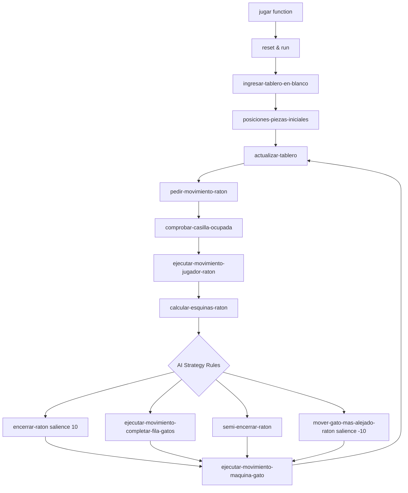

## Overview

The Mouse and Cats game is implemented as a single CLIPS expert system file (`raton_y_gatos.clp`) that uses rule-based programming to control game logic, AI strategy, and board rendering.

## File Structure

The entire game is contained in a single `.clp` file organized into the following sections:

```
raton_y_gatos.clp (2111 lines)
├── Entry Functions (lines 21-71)
├── Templates (lines 76-104)
├── Initial Facts (lines 110-158)
└── Rules (lines 164-2110)
```

### Single File Architecture

Unlike traditional procedural programs, this CLIPS implementation uses a **declarative approach** where:
- All game state is stored as facts in working memory
- All behavior is defined as rules that pattern-match against facts
- Control flow emerges from rule activation and salience priorities

## Control Flow

### Game Initialization

The game starts when a user calls the `(jugar)` function:

```clojure
(deffunction jugar ()
  "Función para comenzar un nuevo juego"
  (clear-window)
  (reset)   ; Loads all initial facts into working memory
  (run)     ; Starts the inference engine
)
```

See: `raton_y_gatos.clp:21-26`

### Fact-Based Game State

The game uses two primary templates to represent state:

**1. Casilla (Board Square)** - `raton_y_gatos.clp:76-87`
```clojure
(deftemplate casilla
  (slot fila (type NUMBER))      ; Row number
  (slot columna (type NUMBER))   ; Column number
  (multislot valor (type NUMBER)) ; Cell value (0=white, 1=black, 4=mouse, 5=cat)
)
```

**2. Pieza (Piece Display)** - `raton_y_gatos.clp:89-104`
```clojure
(deftemplate pieza
  (slot valor)   ; Links to casilla valor
  (slot parte1)  ; Top part of 3x3 ASCII art
  (slot parte2)  ; Middle part
  (slot parte3)  ; Bottom part
)
```

## Rule Activation and Firing

### Rule Priority System

CLIPS uses **salience** to control rule execution order:

| Salience | Rule | Purpose |
|----------|------|--------|
| 10 | `encerrar-raton` | Check if mouse is trapped (highest priority) |
| 0 (default) | Most game rules | Normal AI strategy |
| -10 | `mover-gato-mas-alejado-raton` | Fallback move when no strategy matches |

See: `raton_y_gatos.clp:1325` (salience 10) and `raton_y_gatos.clp:990` (salience -10)

### Pattern Matching Process

<Steps>
  <Step title="Facts are asserted">
    When `(reset)` is called, all facts from `deffacts hechos-iniciales` are loaded into working memory.
  </Step>
  
  <Step title="Rules pattern-match">
    CLIPS examines all rules to find which patterns match the current facts in working memory.
  </Step>
  
  <Step title="Conflict resolution">
    If multiple rules match, CLIPS uses salience, recency, and specificity to choose which rule fires first.
  </Step>
  
  <Step title="Rule fires">
    The selected rule's RHS (right-hand side) executes, which may:
    - Assert new facts
    - Retract existing facts
    - Modify facts
    - Print output
  </Step>
  
  <Step title="Cycle repeats">
    The process repeats until no more rules match or `(halt)` is called.
  </Step>
</Steps>

### Game Loop Flow



## Board Rendering System

### Three-Part Rendering

The board rendering system (`actualizar-tablero` rule, lines 262-363) uses a clever 3-pass approach:

**Each cell is rendered in three parts:**

```
Row 1, parte1:  |(_)_(_)||(_)_(_)||(_)_(_)||(_)_(_)|
Row 1, parte2:  | (o o) || (o o) || (o o) || (o o) |
Row 1, parte3:  |==\o/==||==\o/==||==\o/==||==\o/==|
```

See: `raton_y_gatos.clp:262-363`

### Rendering Algorithm

<Steps>
  <Step title="Initialize print state">
    Fact `(imprime 1 1)` tracks current row/column being rendered.
    Fact `(parteImprimir 1)` tracks which part (1, 2, or 3) to print.
  </Step>
  
  <Step title="Match casilla with pieza">
    The rule matches `casilla` facts with their corresponding `pieza` definition based on the `valor` field.
  </Step>
  
  <Step title="Print part 1 of all columns">
    Iterates through columns 1-8, printing `parte1` of each piece.
  </Step>
  
  <Step title="Print part 2 of all columns">
    Retracts `(parteImprimir 1)`, asserts `(parteImprimir 2)`, repeats for `parte2`.
  </Step>
  
  <Step title="Print part 3 and advance row">
    Prints `parte3`, then increments row counter and resets to `(parteImprimir 1)`.
  </Step>
  
  <Step title="Trigger next phase">
    When row 8, column 8, part 3 completes, assert `(pedir-movimiento-raton)` to continue game.
  </Step>
</Steps>

### Key Rendering Logic

```clojure
; Lines 314-317: Print parte1 and advance column
(if (and (and (<= ?i 8) (< ?j 8)) (= ?parteImprimir 1))then
  (printout t "|" ?p1)
  (assert (imprime ?i (+ ?j 1)))
)

; Lines 320-325: Print parte1 end-of-row, advance to parte2
(if (and (and (<= ?i 8) (= ?j 8)) (= ?parteImprimir 1)) then
  (printout t  "|"?p1"|" crlf  )
  (assert (imprime ?i 1))
  (assert (parteImprimir 2))
  (retract ?f)
)
```

## AI Strategy Architecture

### Strategy Rule Hierarchy

The cats' AI uses multiple rules with different priorities:

1. **Endgame (salience 10)**: `encerrar-raton` - Trap the mouse if it has only one escape
2. **Block formation**: `ejecutar-movimiento-completar-fila-gatos` - Advance cats as a wall
3. **Semi-trap**: `semi-encerrar-raton` - Create pincer movements
4. **Pattern-based**: `cubrir-posible-avance-raton` - Counter specific mouse positions
5. **Fallback (salience -10)**: `mover-gato-mas-alejado-raton` - Move furthest cat toward mouse

Each strategy asserts `(fila-columna-mover-gatos ?row ?col ?catFact)` which triggers the execution rule.

### Control Facts

The system uses control facts to orchestrate rule firing:

- `(ingresar-tablero)` → Triggers board initialization
- `(actualizar-tablero)` → Triggers board rendering
- `(pedir-movimiento-raton)` → Triggers player input
- `(buscar-diagonales-gatos)` → Triggers cat diagonal calculation
- `(finalizar-juego)` → Triggers game over

These facts are asserted and retracted to control the flow of rule activation.

## Key Design Patterns

### Pattern: Control Fact

Rules use control facts to trigger specific behavior:

```clojure
?h <- (pedir-movimiento-raton)  ; Capture and name the fact
=>
(retract ?h)  ; Remove it so rule doesn't fire again
; ... do work ...
```

### Pattern: Fact Modification

Piece movement works by modifying casilla facts:

```clojure
?casilla-a-mover <- (casilla (fila ?f1)(columna ?c1)(valor ?))
?casilla-actual  <- (casilla (fila ?f2)(columna ?c2)(valor 4))
=>
(modify ?casilla-a-mover (valor 4))  ; Move mouse to new square
(modify ?casilla-actual (valor 1))   ; Set old square to black
```

See: `raton_y_gatos.clp:530-536`

### Pattern: Fact Indexing

Cats are identified by their valor multislot:

```clojure
(modify ?gato1 (valor 5 1))  ; Cat #1
(modify ?gato2 (valor 5 2))  ; Cat #2
```

The second number serves as an ID for tracking individual cats.

See: `raton_y_gatos.clp:246-255`

## Performance Considerations

- **64 casilla facts** are created at initialization (8x8 board)
- **Pattern matching** happens on every rule cycle
- **Rendering** iterates 8 rows × 8 columns × 3 parts = 192 rule firings per board display
- **AI evaluation** may test multiple strategies before finding a match

The system is optimized for correctness over performance, suitable for turn-based gameplay.